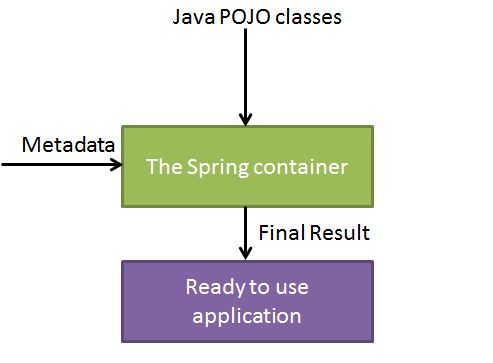

# Spring IoC 容器

## IoC 容器

Spring 容器是 Spring 框架的核心。容器将创建对象，把它们连接在一起，配置它们，并管理他们的整个生命周期从创建到销毁。Spring 容器使用依赖注入（DI）来管理组成一个应用程序的组件。这些对象被称为 Spring Beans，我们将在下一章中进行讨论。

通过阅读配置元数据提供的指令，容器知道对哪些对象进行实例化，配置和组装。配置元数据可以通过 XML，Java 注释或 Java 代码来表示。下图是 Spring 如何工作的高级视图。 Spring IoC 容器利用 Java 的 POJO 类和配置元数据来生成完全配置和可执行的系统或应用程序。

**IOC 容器**具有依赖注入功能的容器，它可以创建对象，IOC 容器负责实例化、定位、配置应用程序中的对象及建立这些对象间的依赖。通常new一个实例，控制权由程序员控制，而"控制反转"是指new实例工作不由程序员来做而是交给Spring容器来做。在Spring中[BeanFactory](https://www.w3cschool.cn/wkspring/j3181mm3.html)是IOC容器的实际代表者。

Spring 提供了以下两种不同类型的容器。

| 序号 | 容器 & 描述                                                  |
| ---- | ------------------------------------------------------------ |
| 1    | [Spring BeanFactory 容器](1.Spring BeanFactory容器.md)它是最简单的容器，给 DI 提供了基本的支持，它用 org.springframework.beans.factory.BeanFactory 接口来定义。BeanFactory 或者相关的接口，如 BeanFactoryAware，InitializingBean，DisposableBean，在 Spring 中仍然存在具有大量的与 Spring 整合的第三方框架的反向兼容性的目的。 |
| 2    | [Spring ApplicationContext 容器](2.Spring ApplicationContext容器.md)该容器添加了更多的企业特定的功能，例如从一个属性文件中解析文本信息的能力，发布应用程序事件给感兴趣的事件监听器的能力。该容器是由 org.springframework.context.ApplicationContext 接口定义。 |

ApplicationContext 容器包括 BeanFactory 容器的所有功能，所以通常不建议使用BeanFactory。BeanFactory 仍然可以用于轻量级的应用程序，如移动设备或基于 applet 的应用程序，其中它的数据量和速度是显著。