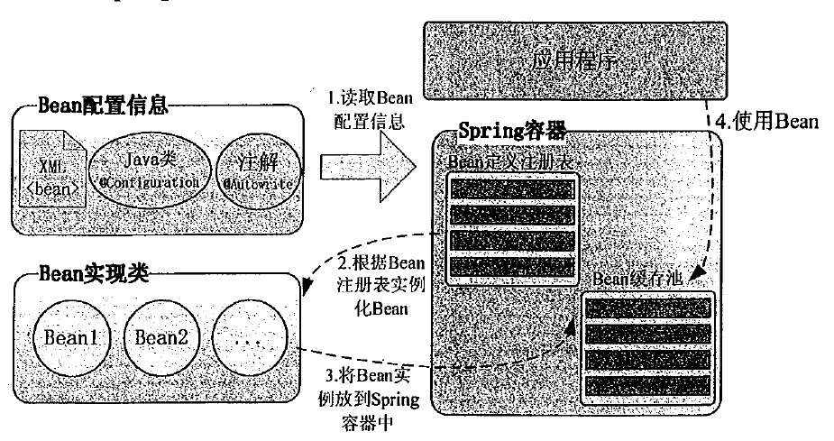

# Spring Bean 定义

## Bean 定义

被称作 bean 的对象是构成应用程序的支柱也是由 Spring IoC 容器管理的。bean 是一个被实例化，组装，并通过 Spring IoC 容器所管理的对象。这些 bean 是由用容器提供的配置元数据创建的，例如，已经在先前章节看到的，在 XML 的表单中的 定义。

bean 定义包含称为**配置元数据**的信息，下述容器也需要知道配置元数据：

- 如何创建一个 bean
- bean 的生命周期的详细信息
- bean 的依赖关系

上述所有的配置元数据转换成一组构成每个 bean 定义的下列属性。

| 属性                     | 描述                                                         |
| ------------------------ | ------------------------------------------------------------ |
| class                    | 这个属性是强制性的，并且指定用来创建 bean 的 bean 类。       |
| name                     | 这个属性指定唯一的 bean 标识符。在基于 XML 的配置元数据中，你可以使用 ID 和/或 name 属性来指定 bean 标识符。 |
| scope                    | 这个属性指定由特定的 bean 定义创建的对象的作用域，它将会在 bean 作用域的章节中进行讨论。 |
| constructor-arg          | 它是用来注入依赖关系的，并会在接下来的章节中进行讨论。       |
| properties               | 它是用来注入依赖关系的，并会在接下来的章节中进行讨论。       |
| autowiring mode          | 它是用来注入依赖关系的，并会在接下来的章节中进行讨论。       |
| lazy-initialization mode | 延迟初始化的 bean 告诉 IoC 容器在它第一次被请求时，而不是在启动时去创建一个 bean 实例。 |
| initialization 方法      | 在 bean 的所有必需的属性被容器设置之后，调用回调方法。它将会在 bean 的生命周期章节中进行讨论。 |
| destruction 方法         | 当包含该 bean 的容器被销毁时，使用回调方法。它将会在 bean 的生命周期章节中进行讨论。 |

**Bean 与 Spring 容器的关系**

下图表达了Bean 与 Spring 容器之间的关系：



## Spring 配置元数据

Spring IoC 容器完全由实际编写的配置元数据的格式解耦。有下面三个重要的方法把配置元数据提供给 Spring 容器：

- 基于 XML 的配置文件
- 基于注解的配置
- 基于 Java 的配置

提示：对于基于 XML 的配置，Spring 2.0 以后使用 Schema 的格式，使得不同类型的配置拥有了自己的命名空间，是配置文件更具扩展性。

你已经看到了如何把基于 XML 的配置元数据提供给容器，但是让我们看看另一个基于 XML 配置文件的例子，这个配置文件中有不同的 bean 定义，包括延迟初始化，初始化方法和销毁方法的：

```xml
<?xml version="1.0" encoding="UTF-8"?>

<beans xmlns="http://www.springframework.org/schema/beans"
    xmlns:xsi="http://www.w3.org/2001/XMLSchema-instance"
    xsi:schemaLocation="http://www.springframework.org/schema/beans
    http://www.springframework.org/schema/beans/spring-beans-3.0.xsd">

   <!-- A simple bean definition -->
   <bean id="..." class="...">
       <!-- collaborators and configuration for this bean go here -->
   </bean>

   <!-- A bean definition with lazy init set on -->
   <bean id="..." class="..." lazy-init="true">
       <!-- collaborators and configuration for this bean go here -->
   </bean>

   <!-- A bean definition with initialization method -->
   <bean id="..." class="..." init-method="...">
       <!-- collaborators and configuration for this bean go here -->
   </bean>

   <!-- A bean definition with destruction method -->
   <bean id="..." class="..." destroy-method="...">
       <!-- collaborators and configuration for this bean go here -->
   </bean>

   <!-- more bean definitions go here -->

</beans>
```

在上述示例中：

①xmlns="http://www.springframework.org/schema/beans"，默认命名空间：它没有空间名，用于Spring Bean的定义；

②xmlns:xsi="http://www.w3.org/2001/XMLSchema-instance"，xsi命名空间：这个命名空间用于为每个文档中命名空间指定相应的Schema样式文件，是标准组织定义的标准命名空间。

你可以查看 [**Spring Hello World 实例**](https://www.w3cschool.cn/wkspring/dgte1ica.html) 来详细理解如何定义，配置和创建 Spring Beans。

关于基于注解的配置将在一个单独的章节中进行讨论。刻意把它保留在一个单独的章节，是因为我想让你在开始使用注解和 Spring 依赖注入编程之前，能掌握一些其他重要的 Spring 概念。