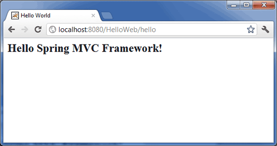

# Spring MVC Hello World 例子

## Spring MVC Hello World 例子

下面的例子说明了如何使用 Spring MVC 框架来编写一个简单的基于 web 的 Hello World 应用程序。下面让我们使用 Eclipse IDE，然后按照下面的步骤使用 Spring 的 Web 框架来开发一个动态 Web 应用程序：

| 步骤 | 描述                                                         |
| ---- | ------------------------------------------------------------ |
| 1    | 创建一个名称为 HelloWeb 的动态 Web 项目，并且在已创建的项目的 src 文件夹中创建一个包 com.tutorialspoint。 |
| 2    | 将上面提到的 Spring 和其他库拖拽到文件夹 WebContent/WEB-INF/lib 中。 |
| 3    | 在 com.tutorialspoint 包下创建一个 Java 类 HelloController。 |
| 4    | 在 WebContent/WEB-INF 文件夹下创建 Spring 的配置文件 Web.xml 和 HelloWeb-servlet.xml。 |
| 5    | 在 WebContent/WEB-INF 文件夹下创建名称为 jsp 的子文件夹。在这个子文件夹下创建一个视图文件 hello.jsp。 |
| 6    | 最后一步是创建所有的源代码和配置文件的内容，并导出该应用程序，正如下面解释的一样。 |

这是 **HelloController.java** 文件的内容：

```java
package com.tutorialspoint;
import org.springframework.stereotype.Controller;
import org.springframework.web.bind.annotation.RequestMapping;
import org.springframework.web.bind.annotation.RequestMethod;
import org.springframework.ui.ModelMap;
@Controller
@RequestMapping("/hello")
public class HelloController{ 
   @RequestMapping(method = RequestMethod.GET)
   public String printHello(ModelMap model) {
      model.addAttribute("message", "Hello Spring MVC Framework!");
      return "hello";
   }
}
```

下面是 Spring Web 配置文件 **web.xml** 的内容


```xml
<web-app id="WebApp_ID" version="2.4"
   xmlns="http://java.sun.com/xml/ns/j2ee" 
   xmlns:xsi="http://www.w3.org/2001/XMLSchema-instance"
   xsi:schemaLocation="http://java.sun.com/xml/ns/j2ee 
   http://java.sun.com/xml/ns/j2ee/web-app_2_4.xsd">
 
   <display-name>Spring MVC Application</display-name>
 
   <servlet>
      <servlet-name>HelloWeb</servlet-name>
      <servlet-class>
         org.springframework.web.servlet.DispatcherServlet
      </servlet-class>
      <load-on-startup>1</load-on-startup>
   </servlet>
 
   <servlet-mapping>
      <servlet-name>HelloWeb</servlet-name>
      <url-pattern>/</url-pattern>
   </servlet-mapping>
</web-app>
```

下面是另一个 Spring Web 配置文件 **HelloWeb-servlet.xml** 的内容

```xml
<beans xmlns="http://www.springframework.org/schema/beans"
   xmlns:context="http://www.springframework.org/schema/context"
   xmlns:xsi="http://www.w3.org/2001/XMLSchema-instance"
   xsi:schemaLocation="
   http://www.springframework.org/schema/beans     
   http://www.springframework.org/schema/beans/spring-beans-3.0.xsd
   http://www.springframework.org/schema/context 
   http://www.springframework.org/schema/context/spring-context-3.0.xsd">
 
   <context:component-scan base-package="com.tutorialspoint" />
 
   <bean class="org.springframework.web.servlet.view.InternalResourceViewResolver">
      <property name="prefix" value="/WEB-INF/jsp/" />
      <property name="suffix" value=".jsp" />
   </bean></beans>
```

下面是 Spring 视图文件 **hello.jsp** 的内容

```jsp
<%@ page contentType="text/html; charset=UTF-8" %>
<html>
<head>
<title>Hello World</title>
</head>
<body>
   <h2>${message}</h2>
</body>
</html>
```

最后，下面是包含在你的 web 应用程序中的 Spring 和其他库。你仅仅需要将这些文件拖拽到 **WebContent/WEB-INF/lib** 文件夹中。

- commons-logging-x.y.z.jar
- org.springframework.asm-x.y.z.jar
- org.springframework.beans-x.y.z.jar
- org.springframework.context-x.y.z.jar
- org.springframework.core-x.y.z.jar
- org.springframework.expression-x.y.z.jar
- org.springframework.web.servlet-x.y.z.jar
- org.springframework.web-x.y.z.jar
- spring-web.jar

一旦你完成了创建源代码和配置文件后，导出你的应用程序。右键单击你的应用程序，并且使用 **Export > WAR File** 选项，在 Tomcat 的 *webapps* 文件夹中保存你的 **HelloWeb.war** 文件。

现在启动你的 Tomcat 服务器，并且确保你能够使用标准的浏览器访问 webapps 文件夹中的其他 web 页面。现在尝试访问该 URL **http://localhost:8080/HelloWeb/hello**。如果你的 Spring Web 应用程序一切都正常，你应该看到下面的结果：



你应该注意，在给定的 URL 中，**HelloWeb** 是这个应用程序的名称，并且 **hello** 是我们在控制器中使用 @RequestMapping("/hello") 提到的虚拟子文件夹。当使用 **@RequestMapping("/")** 映射你的 URL 时，你可以使用直接 root，在这种情况下，你可以使用短 URL **http://localhost:8080/HelloWeb/** 访问相同的页面，但是建议在不同的文件夹下有不同的功能。