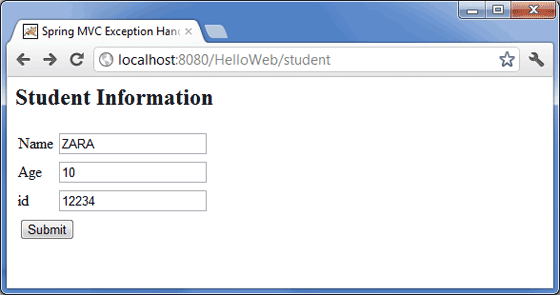
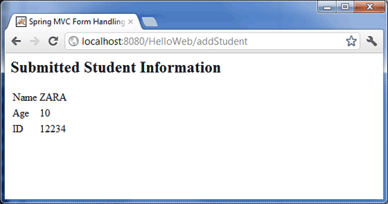

# Spring MVC 表单处理例子

## Spring MVC 表单处理例子

下面的例子说明了如何编写一个简单的基于 web 的应用程序，它利用了使用 Spring 的 Web MVC 框架的 HTML 表单。为了开始使用它，让我们在恰当的位置使用 Eclipse IDE，然后按照下面的步骤使用 Spring 的 Web 框架来开发一个动态的基于表单的 Web 应用程序：

| 步骤 | 描述                                                         |
| ---- | ------------------------------------------------------------ |
| 1    | 创建一个名称为 *HelloWeb* 的*动态 Web 项目*，并且在已创建的项目的 *src* 文件夹中创建一个包 *com.tutorialspoint*。 |
| 2    | 将上面提到的 Spring 和其他库拖拽到文件夹 *WebContent/WEB-INF/lib* 中。 |
| 3    | 在 *com.tutorialspoint* 包下创建一个 Java 类 *Student* 和 *StudentController*。 |
| 4    | 在 *WebContent/WEB-INF* 文件夹下创建 Spring 的配置文件 *Web.xml* 和 *HelloWeb-servlet.xml*。 |
| 5    | 在 *WebContent/WEB-INF* 文件夹下创建名称为 *jsp* 的子文件夹。在这个子文件夹下创建视图文件 *student.jsp* 和 *result.jsp*。 |
| 6    | 最后一步是创建所有的源代码和配置文件的内容，并导出该应用程序，正如下面解释的一样。 |

这里是 **Student.java** 文件的内容：

```java
package com.tutorialspoint;
public class Student {
   private Integer age;
   private String name;
   private Integer id;
   public void setAge(Integer age) {
      this.age = age;
   }
   public Integer getAge() {
      return age;
   }
   public void setName(String name) {
      this.name = name;
   }
   public String getName() {
      return name;
   }
   public void setId(Integer id) {
      this.id = id;
   }
   public Integer getId() {
      return id;
   }
}
```

下面是 **StudentController.java** 文件的内容：

关于@ModelAttribute的使用，

查看 @ModelAttribute注解定义可以看到这个注解可以用在方法和参数中，将请求参数绑定到Model对象。

可前往springmvc教程中的[该章节](https://www.w3cschool.cn/spring_mvc_documentation_linesh_translation/spring_mvc_documentation_linesh_translation-z5xb27re.html)查看详细内容。

```java
package com.tutorialspoint;
import org.springframework.stereotype.Controller;
import org.springframework.web.bind.annotation.ModelAttribute;
import org.springframework.web.bind.annotation.RequestMapping;
import org.springframework.web.bind.annotation.RequestMethod;
import org.springframework.web.servlet.ModelAndView;
import org.springframework.ui.ModelMap;
@Controller
public class StudentController {
   @RequestMapping(value = "/student", method = RequestMethod.GET)
   public ModelAndView student() {
      return new ModelAndView("student", "command", new Student());
   }   
   @RequestMapping(value = "/addStudent", method = RequestMethod.POST)
   public String addStudent(@ModelAttribute("SpringWeb")Student student, 
   ModelMap model) {
      model.addAttribute("name", student.getName());
      model.addAttribute("age", student.getAge());
      model.addAttribute("id", student.getId());      
      return "result";
   }
}
```

在这里，第一个 service 方法 **student()**，我们已经在名称为 “command” 的 ModelAndView 对象中传递一个空的 **Student** 对象，因为 spring 框架需要一个名称的 “command” 的对象，如果你在 JSP 文件中使用 <form:form> 标签。所以，当 **student()** 方法被调用时，它返回 **student.jsp** 视图。

第二个 service 方法 **addStudent()** 将调用 **HelloWeb/addStudent** URL 中的 POST 方法。你将根据提交的信息准备好你的模型对象。最后一个 “result” 视图会从 service 方法中返回，它将导致呈现 result.jsp。

下面是 Spring Web 配置文件 **web.xml** 的内容

```xml
<web-app id="WebApp_ID" version="2.4"
    xmlns="http://java.sun.com/xml/ns/j2ee" 
    xmlns:xsi="http://www.w3.org/2001/XMLSchema-instance"
    xsi:schemaLocation="http://java.sun.com/xml/ns/j2ee 
    http://java.sun.com/xml/ns/j2ee/web-app_2_4.xsd">

    <display-name>Spring MVC Form Handling</display-name>

    <servlet>
        <servlet-name>HelloWeb</servlet-name>
        <servlet-class>
           org.springframework.web.servlet.DispatcherServlet
        </servlet-class>
        <load-on-startup>1</load-on-startup>
    </servlet>

    <servlet-mapping>
        <servlet-name>HelloWeb</servlet-name>
        <url-pattern>/</url-pattern>
    </servlet-mapping>

</web-app>
```

下面是另一个 Spring Web 配置文件 **HelloWeb-servlet.xml** 的内容

```xml
<beans xmlns="http://www.springframework.org/schema/beans"
   xmlns:context="http://www.springframework.org/schema/context"
   xmlns:xsi="http://www.w3.org/2001/XMLSchema-instance"
   xsi:schemaLocation="
   http://www.springframework.org/schema/beans     
   http://www.springframework.org/schema/beans/spring-beans-3.0.xsd
   http://www.springframework.org/schema/context 
   http://www.springframework.org/schema/context/spring-context-3.0.xsd">

   <context:component-scan base-package="com.tutorialspoint" />

   <bean class="org.springframework.web.servlet.view.InternalResourceViewResolver">
      <property name="prefix" value="/WEB-INF/jsp/" />
      <property name="suffix" value=".jsp" />
   </bean>

</beans>
```

下面是 Spring 视图文件 **student.jsp** 的内容

```jsp
<%@taglib uri="http://www.springframework.org/tags/form" prefix="form"%>
<html>
<head>
    <title>Spring MVC Form Handling</title>
</head>
<body>

<h2>Student Information</h2>
<form:form method="POST" action="/HelloWeb/addStudent">
   <table>
    <tr>
        <td><form:label path="name">Name</form:label></td>
        <td><form:input path="name" /></td>
    </tr>
    <tr>
        <td><form:label path="age">Age</form:label></td>
        <td><form:input path="age" /></td>
    </tr>
    <tr>
        <td><form:label path="id">id</form:label></td>
        <td><form:input path="id" /></td>
    </tr>
    <tr>
        <td colspan="2">
            <input type="submit" value="Submit"/>
        </td>
    </tr>
</table>  
</form:form>
</body>
</html>
```

下面是 Spring 视图文件 **result.jsp** 的内容

```jsp
<%@taglib uri="http://www.springframework.org/tags/form" prefix="form"%>
<html>
<head>
    <title>Spring MVC Form Handling</title>
</head>
<body>

<h2>Submitted Student Information</h2>
   <table>
    <tr>
        <td>Name</td>
        <td>${name}</td>
    </tr>
    <tr>
        <td>Age</td>
        <td>${age}</td>
    </tr>
    <tr>
        <td>ID</td>
        <td>${id}</td>
    </tr>
</table>  
</body>
</html>
```

最后，下面是包含在你的 web 应用程序中的 Spring 和其他库的列表。你仅仅需要将这些文件拖拽到 **WebContent/WEB-INF/lib** 文件夹中。

- commons-logging-x.y.z.jar
- org.springframework.asm-x.y.z.jar
- org.springframework.beans-x.y.z.jar
- org.springframework.context-x.y.z.jar
- org.springframework.core-x.y.z.jar
- org.springframework.expression-x.y.z.jar
- org.springframework.web.servlet-x.y.z.jar
- org.springframework.web-x.y.z.jar
- spring-web.jar

一旦你完成了创建源代码和配置文件后，导出你的应用程序。右键单击你的应用程序，并且使用 **Export > WAR File** 选项，并且在 Tomcat 的 *webapps* 文件夹中保存你的 **HelloWeb.war** 文件。

现在启动你的 Tomcat 服务器，并且确保你能够使用标准的浏览器访问 webapps 文件夹中的其他 web 页面。现在尝试访问该 URL **http://localhost:8080/HelloWeb/student**。如果你的 Spring Web 应用程序一切都正常，你应该看到下面的结果：



在提交必需的信息之后，单击提交按钮来提交这个表单。如果你的 Spring Web 应用程序一切都正常，你应该看到下面的结果：



### **问题处理：**

\1. 如果提交表单之后出现404，可以在student.jsp页面中把 `<form action="/logon">`

改为 `<form action="${pageContext.request.contextPath}/logon">`