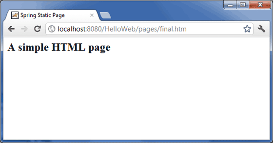

# Spring 静态页面例子

## Spring 静态页面例子

下面的例子说明了如何使用 Spring MVC 框架来编写一个简单的基于 web 的应用程序，它可以在 <mvc:resources> 标签的帮助下访问静态页面和动态页面。为了开始使用它，让我们在恰当的位置使用 Eclipse IDE，然后按照下面的步骤使用 Spring 的 Web 框架来开发一个动态的基于表单的 Web 应用程序：

| 步骤 | 描述                                                         |
| ---- | ------------------------------------------------------------ |
| 1    | 创建一个名称为 *HelloWeb* 的*动态 Web 项目*，并且在已创建的项目的 *src* 文件夹中创建一个包 *com.tutorialspoint*。 |
| 2    | 将上面提到的 Spring 和其他库拖拽到文件夹 *WebContent/WEB-INF/lib* 中。 |
| 3    | 在 *com.tutorialspoint* 包下创建一个 Java 类 *WebController*。 |
| 4    | 在 *WebContent/WEB-INF* 文件夹下创建 Spring 的配置文件 *Web.xml* 和 *HelloWeb-servlet.xml*。 |
| 5    | 在 *WebContent/WEB-INF* 文件夹下创建名称为 *jsp* 的子文件夹。在这个子文件夹下创建一个视图文件 *index.jsp*。 |
| 6    | 在 *WebContent/WEB-INF* 文件夹下创建名称为 *pages* 的子文件夹。在这个子文件夹下创建一个静态文件 *final.htm* |
| 7    | 最后一步是创建所有的源代码和配置文件的内容，并导出该应用程序，正如下面解释的一样。 |

这里是 **WebController.java** 文件的内容：

```java
package com.tutorialspoint;
import org.springframework.stereotype.Controller;
import org.springframework.web.bind.annotation.RequestMapping;
import org.springframework.web.bind.annotation.RequestMethod;
@Controller
public class WebController {
   @RequestMapping(value = "/index", method = RequestMethod.GET)
   public String index() {
       return "index";
   }   
   @RequestMapping(value = "/staticPage", method = RequestMethod.GET)
   public String redirect() {     
      return "redirect:/pages/final.htm";
   }
}
```

下面是 Spring Web 配置文件 **web.xml** 的内容

```xml
<web-app id="WebApp_ID" version="2.4"
    xmlns="http://java.sun.com/xml/ns/j2ee" 
    xmlns:xsi="http://www.w3.org/2001/XMLSchema-instance"
    xsi:schemaLocation="http://java.sun.com/xml/ns/j2ee 
    http://java.sun.com/xml/ns/j2ee/web-app_2_4.xsd">

    <display-name>Spring Page Redirection</display-name>

    <servlet>
        <servlet-name>HelloWeb</servlet-name>
        <servlet-class>
           org.springframework.web.servlet.DispatcherServlet
        </servlet-class>
        <load-on-startup>1</load-on-startup>
    </servlet>

    <servlet-mapping>
        <servlet-name>HelloWeb</servlet-name>
        <url-pattern>/</url-pattern>
    </servlet-mapping>

</web-app>
```

下面是另一个 Spring Web 配置文件 **HelloWeb-servlet.xml** 的内容

```xml
<?xml version="1.0" encoding="UTF-8"?>
<beans xmlns="http://www.springframework.org/schema/beans"
 xmlns:xsi="http://www.w3.org/2001/XMLSchema-instance" 
 xmlns:context="http://www.springframework.org/schema/context"
 xmlns:mvc="http://www.springframework.org/schema/mvc"
 xsi:schemaLocation="http://www.springframework.org/schema/beans
 http://www.springframework.org/schema/beans/spring-beans-2.5.xsd
 http://www.springframework.org/schema/mvc
 http://www.springframework.org/schema/mvc/spring-mvc-3.0.xsd
 http://www.springframework.org/schema/context
 http://www.springframework.org/schema/context/spring-context-3.0.xsd">

    <context:component-scan base-package="com.tutorialspoint" />

    <bean id="viewResolver" class="org.springframework.web.servlet.view.InternalResourceViewResolver">
    <property name="prefix" value="/WEB-INF/jsp/" />
    <property name="suffix" value=".jsp" />
    </bean>

    <mvc:resources mapping="/pages/**" location="/WEB-INF/pages/" />
    <mvc:annotation-driven/>

</beans>
```

在这里，**<mvc:resources..../>** 标签被用来映射静态页面。 **mapping** 属性必须是一个指定一个 http 请求的 URL 模式的 Ant 模式。 **location** 属性必须指定一个或者多个具有包含图片，样式表，JavaScript 和其他静态内容的静态页面的资源目录位置。多个资源位置可以使用逗号分隔这些值的列表来被指定。

下面是 Spring 视图文件 **WEB-INF/jsp/index.jsp** 的内容。这将是一个登陆页面，这个页面将发送一个请求来访问 **staticPage** 的 service 方法，它将重定向这个请求到 WEB-INF/pages 文件夹中的一个可用的静态页面。

```jsp
<%@taglib uri="http://www.springframework.org/tags/form" prefix="form"%>
<html>
<head>
    <title>Spring Landing Page</title>
</head>
<body>
<h2>Spring Landing Pag</h2>
<p>Click below button to get a simple HTML page</p>
<form:form method="GET" action="/HelloWeb/staticPage">
<table>
    <tr>
    <td>
    <input type="submit" value="Get HTML Page"/>
    </td>
    </tr>
</table>  
</form:form>
</body>
</html>
```

下面是 Spring 视图文件 **WEB-INF/pages/final.htm** 的内容。

```jsp
<html>
<head>
    <title>Spring Static Page</title>
</head>
<body>

<h2>A simple HTML page</h2>

</body>
</html>
```

最后，下面是包含在你的 web 应用程序中的 Spring 和其他库的列表。你仅仅需要将这些文件拖拽到 **WebContent/WEB-INF/lib** 文件夹中。

- commons-logging-x.y.z.jar
- org.springframework.asm-x.y.z.jar
- org.springframework.beans-x.y.z.jar
- org.springframework.context-x.y.z.jar
- org.springframework.core-x.y.z.jar
- org.springframework.expression-x.y.z.jar
- org.springframework.web.servlet-x.y.z.jar
- org.springframework.web-x.y.z.jar
- spring-web.jar

一旦你完成了创建源代码和配置文件后，导出你的应用程序。右键单击你的应用程序，并且使用 **Export > WAR File** 选项，并且在 Tomcat 的 *webapps* 文件夹中保存你的 **HelloWeb.war** 文件。

现在启动你的 Tomcat 服务器，并且确保你能够使用标准的浏览器访问 webapps 文件夹中的其他 web 页面。现在尝试访问该 URL **http://localhost:8080/HelloWeb/index**。 如果你的 Spring Web 应用程序一切都正常，你应该看到下面的结果：


单击 “Get HTML Page” 按钮来访问 staticPage 中的 service 方法中提到的一个静态页面。如果你的 Spring Web 应用程序一切都正常，你应该看到下面的结果：

